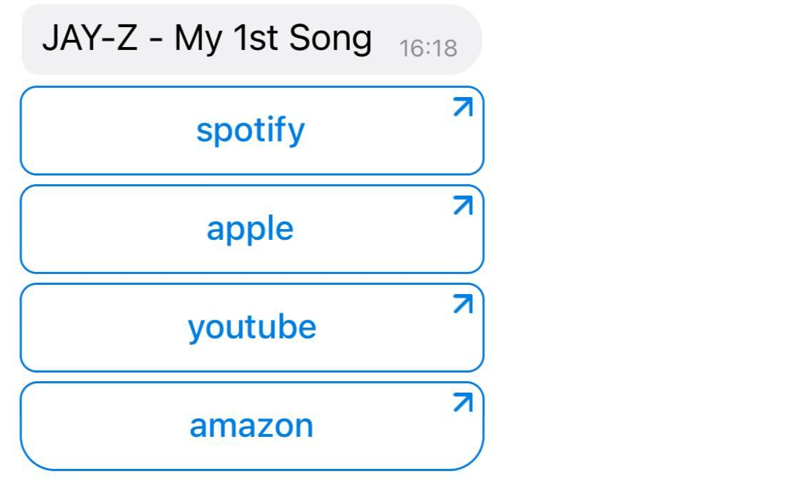

# UCU Semester Project
## Musical Telegram

### Description
Musical Telegram is a Telegram bot that recommends music. It utilizes the Spotify API, and uses machine learning for smart music recomendation. 

### Usage
Find and launch the bot in Telegram with the following address: @music_finder_tg_bot
Follow next instructions given in the bot

### Purpose and short characterictics
Bot is used for serching and finding the best appropriate tracks using the user's playlist or just with the number of inputted songs

### Input and output of the program

#### <b>I stage</b>
Input: choosing the convenient way of inputting the information
Output: going to the second stage

#### <b>II stage</b>
Input: song name or playlist id
Output: set of recommended songs

#### <b>III stage</b>
Input: one of the chosen songs
Output: link on it in all the most popular streaming services Apple Music, Spotify, YouTube Music, Amazon Music)

### Program structure with short description of modules, functions, classes and methods
#### <b>Service Worker</b>

1. <b>search_track</b> - search for a track with Sporify API by its name.
2. <b>search_tracks_from_playlist</b> - output all tracks from the Spotify playlist with the given id.
3. <b>get_url</b> - Get the Spotify url for the track.
4. <b>get_mean_vector</b> - Return a vector with mean values for each track from the given list.
5. <b>normalize_names</b> - Search for tracks and return their actual names in the Spotify database.
6. <b>get_artists_popularities</b> - Traverse through a given list of artists and search for their popularity using Spotify API. Return a dictionary of key-value pairs where keys are artists and values are their popularity rate.
7. <b>recommend_songs</b> - Recommend songs based on the given list of songs and the dataset.

#### <b>Scrapper</b>

1. get_links - get links for major streaming services for the given track.

### Description of the test examples in order to check the program
Just when the user launches the bot, (s)he receives greeting intro, where bot represents itself. Then the user is to choose one of two options (which are represented at the buttons): to search songs with the playlist of with the inputted set of songs.\\ 

When the user decides to search song with his/her playlist, (s)he is asked to input his playlist id.

Otherwise it is asked to input tracks one by one or just one track.

Then the whole list of tacks is represented.

If the user touches the one track, (s)he can receive the link to different streaming services to listen to music there.

### Authors
See [AUTHORS](./AUTHORS)

### License
[MIT](./LICENSE)

